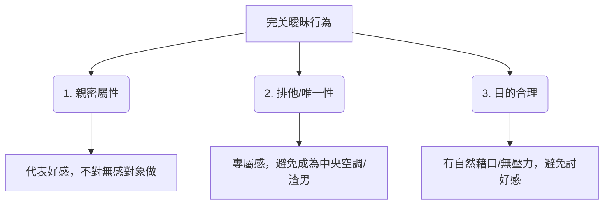

# 🎯 高級感曖昧行為指南：三大元素拆解與實戰行為庫

曖昧是親密關係中最具張力、也最令人心動的階段。然而，拿捏不當的曖昧容易流於「油膩/渣男」或「刻意討好/卑微」。

本指南基於**曖昧行為三元素理論**，拆解如何自然、得體地傳遞好感，並精選 10 個核心曖昧行為進行深度評估與實戰示範。

---

## 📌 曖昧行為的三大核心元素

一個能讓關係順暢升溫、且不失高價值的曖昧行為，必須同時滿足以下三個條件：

1.  **親密屬性（好感引擎）**
    *   **核心定義**：此行為必須隱含「好感」與「想拉近關係」的意圖。
    *   **自我檢測**：如果換成一個毫無興趣的普通朋友，我還會想「主動」對他做這件事嗎？如果答案是「不會」，則該行為具備親密屬性。
2.  **排他/唯一性（安全感護城河）**
    *   **核心定義**：此行為必須是「專屬的」，只對心儀對象做。
    *   **自我檢測**：如果我對身邊所有異性都這麼做，會不會被冠上「中央空調」、「海王」或「渣男」的稱號？若是，這代表該行為一旦泛濫就會貶值，必須嚴格限制僅對「她」輸出。
3.  **目的合理（高價值盾牌）**
    *   **核心定義**：行為背後有輕鬆、自然的因果關係包裝（藉口），讓對方收下好意時「毫無壓力」，同時也保護了自己的姿態。
    *   **自我檢測**：這件事做起來，會不會讓對方覺得我只是在「刻意討好」或「無端奉承」？如果會，則需要加上合理的「媒介」或「理由」來稀釋目的性。

### 🧩 三元素交互關係矩陣

| 親密屬性 (有好感) | 排他/唯一性 (只對你) | 目的合理 (有藉口/無壓力) | 最終關係狀態 / 對方感受 | 狀態解析 |
| :---: | :---: | :---: | :---: | :--- |
| ✅ | ❌ | ✅ / ❌ | **海王 / 渣男行徑** | 對大家都好、到處撒網，顯得極度廉價且缺乏安全感。 |
| ✅ | ✅ | ❌ | **刻意討好 / 舔狗** | 沒有合理由頭就拼命付出，給對方極大壓迫感，顯得卑微。 |
| ❌ | ✅ | ✅ | **普通社交 / 誤會** | 沒有好感成分，只是剛好有正當理由順便幫忙，容易流於普通朋友。 |
| **✅ (有)** | **✅ (專屬)** | **✅ (自然)** | 🎯 **高級感曖昧** | **既能傳遞好感，又維持了高價值與無壓力的相處氛圍。** |

---

## 📂 實戰曖昧行為庫：10 大核心行為拆解

以下根據「語言/訊息」、「實體接觸/空間」、「生活照顧/順便」、「情緒/深度互動」四大維度，精選 10 個核心曖昧行為進行詳細拆解。

### 一、 訊息與語言交流維度

#### 1. 主動且持續地分享「無意義的日常瑣事與照片」
*   **親密屬性解析**：分享欲是最高級的告白。把時間花在與對方分享「路邊的貓」、「好吃的午餐」或「天空的雲」，代表日常中無時無刻不在聯想對方。
*   **排他/唯一性防護**：若對所有人天天發「早安晚安、午餐吃什麼、路邊的狗」，就是散播漁網的中央空調。此分享頻率應僅限於特別對象。
*   **目的合理化**：**以「有趣/好玩/實用」的媒介包裝**，而不是無端報告行蹤。
*   **💬 實際操作範例**：
    > 「今天路過這家咖啡店，門口這隻貓的臭臉長得超像你常用的那個傻眼貼圖，隨手拍給你看（附圖）。」

#### 2. 半開玩笑的「關係測試」與專屬稱呼
*   **親密屬性解析**：創造出只有兩個人才懂的內部梗（Inside Joke），在言語中建立心理上的「兩人特權特區」。
*   **排他/唯一性防護**：如果對每個異性都叫「小笨蛋」、「小豬」或開類似的曖昧玩笑，會---

## 📌 常見的經典曖昧互動與舉例列表

除了上述的系統化行為，以下保留 11 個日常約會與相處中最經典、最自然的曖昧互動與核心解析：

1. **共喝一杯飲料 / 共用吸管**：以「想嚐鮮口味/大杯分食喝不完」為由共喝，利用唾液交換的潛意識隱喻拉近親密感。
2. **摸頭殺（輕撫或揉揉頭髮）**：在對方做出蠢萌或努力的事情後，以「寵溺/安慰」為由輕揉頭髮，建立專屬的特別照顧感。
3. **穿對方的外套 / 披上大衣**：在天氣冷或冷氣強時，以「怕你感冒」為由遞出自己帶有體溫與氣味的外套，製造被擁抱的宣示效果。
4. **共撐一把傘**：在雨天利用不可抗力拉近物理距離，並透過「將傘偏向對方（自己肩膀濕透）」傳遞排他性的關懷。
5. **餵食對方 / 分享食物**：在對方雙手不便或分享特色美食時，以「趁熱吃/這口超讚」為由直接投餵，突破社交防線。
6. **幫忙擦拭嘴角的髒污**：在對方用餐嘴角沾到東西時，以「你嘴角有醬汁」為由，自然地用面紙或指尖輕拭，建立親暱感。
7. **過馬路或人潮擁擠時肢體接觸**：以「注意安全」為由輕拉手臂或護住肩膀短暫拉近距離，通過後自然放開，維持目的合理與分寸。
8. **幫忙整理頭髮或調整衣服**：以「頭髮上有棉屑/領子歪了」為正當由頭，縮短物理距離進行微小整理，測試對方對身體接觸的排斥感。
9. **幫對方拿包包**：在對方走路累了或拿著重物時，以「順手幫忙」為由幫忙拿，用無壓力的體貼展現高價值的照顧能力。
10. **長時間的眼神接觸**：對話時專注地凝視對方雙眼，以「專心聆聽」或讚美「今天眼睛很好看」為合理解釋，在無聲中累積心動張力。
11. **主動載送對方回家**：以「深夜安全/順路送你」為由提供安全護送，並堅持看著對方安全走進大門，傳遞專屬的安全感與排他守護。
